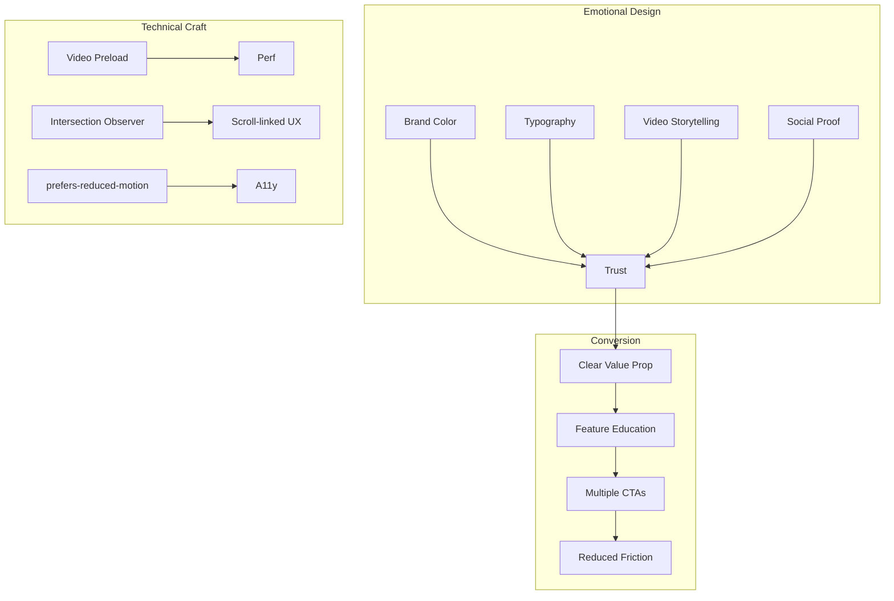

# Reimagined Orchids.app Landing Page

[](https://www.youtube.com/watch?v=m0Ldh-8i6WM)

---

## Project Overview

Orchids is a vibecodingf platform that helps anyone ship better code, faster. This case study documents the complete redesign of the Orchids landing page focused on emotional design, SEO optimization, product education, and conversion strategy.

**Tech Stack**: Next.js 16, React 19, Tailwind CSS 4, Radix UI, Inter + Libre Baskerville fonts

---

## Design Philosophy: Emotional Design

Every design decision was made with emotional resonance in mind. Here's how each choice contributes to building trust and connection:

| Decision | Implementation | Files |
|----------|---------------|-------|
| **Brand color (soft magenta)** | `brand-50` / `brand-200` used sparingly for selection highlights and CTA backgrounds—evokes warmth, creativity, and approachability | [`globals.css`](src/app/globals.css), [`cta-section.tsx`](src/components/cta-section.tsx) |
| **Typography pairing** | Libre Baskerville (serif) for headlines, Inter (sans-serif) for body—creates a crafted, trustworthy editorial feel | [`layout.tsx`](src/app/layout.tsx) |
| **Lowercase "orchids"** | Consistent lowercase branding throughout—friendly, approachable, modern | [`header.tsx`](src/components/header.tsx), [`footer.tsx`](src/components/footer.tsx) |
| **Video-first storytelling** | Hero video + scroll-linked feature demos replace static screenshots—immersive, authentic product demonstration | [`hero-section.tsx`](src/components/hero-section.tsx), [`features.tsx`](src/components/features.tsx) |
| **Interactive term demos** | Hover previews for "apps", "games", "tools", "websites", "UI" in hero copy—playful discovery, "show don't tell" | [`hero-description.tsx`](src/components/hero-description.tsx) |
| **Social proof** | Trust logos (Booking.com, IBM, Netflix, Spotify), Product Hunt awards, testimonial marquee—builds credibility through association | [`trust.tsx`](src/components/trust.tsx), [`awards.tsx`](src/components/awards.tsx), [`cta-section.tsx`](src/components/cta-section.tsx) |

### The Psychology Behind the Choices

- **Soft magenta palette**: Chosen to stand out from typical tech blue/green while remaining professional. The color appears only in strategic moments (selection states, CTA backgrounds) to create delight without overwhelming.
- **Serif headlines**: Libre Baskerville adds editorial weight and craftsmanship—signaling that Orchids is a thoughtful, well-designed tool, not just another AI product.
- **Video over static**: Videos demonstrate real product capabilities, reducing cognitive load and building trust faster than feature lists.

---

## SEO & Accessibility

### Semantic Structure

Every section uses proper HTML5 semantics with ARIA labels:

- `<section>` elements with descriptive `aria-label` attributes
- Proper heading hierarchy (`h1` → `h2` → `h3`)
- Semantic roles (`role="list"`, `role="listitem"`, `role="banner"`, `role="contentinfo"`)
- Alt text on all images

### Next.js Metadata

Basic SEO metadata is configured in [`layout.tsx`](src/app/layout.tsx):

```typescript
export const metadata: Metadata = {
  title: "Orchids | AI-Powered IDE",
  description: "The context-aware AI IDE that helps you ship the best code, faster.",
};
```

**Future improvements**: Open Graph tags, Twitter cards, structured data (JSON-LD), and keyword optimization.

### Accessibility Features

- **`prefers-reduced-motion`**: Autoplay videos are disabled when users prefer reduced motion ([`features.tsx`](src/components/features.tsx) lines 31-44, 125)
- **Keyboard navigation**: All interactive elements are keyboard accessible
- **Focus management**: Visible focus indicators on all interactive elements
- **Screen reader support**: ARIA labels and semantic HTML throughout

---

## Product Education & Conversion

### Clear Value Proposition

The hero H1 immediately communicates what Orchids does:

> "Orchids is the context-aware AI IDE that helps you ship the best code, faster"

No jargon, no ambiguity—just a clear promise.

### Feature Storytelling

Three core features are presented with scroll-linked video demos:

1. **Build at the speed of thought** — Voice + screen context for natural coding
2. **See it, grab it, ship it** — Extract UI from any website directly into your project
3. **Go full-stack without the setup tax** — Native Supabase and Stripe integrations

Each feature includes:
- Compelling headline
- Descriptive copy
- Video demonstration
- "Learn more" CTA for deeper exploration

### Conversion Tactics

**Multiple CTAs**: Download buttons appear in:
- Header (always visible)
- Hero section (primary action)
- Each feature card
- Dedicated CTA section

**Platform choice**: Dropdown menus allow users to select macOS, Windows, or Linux—reducing friction for multi-platform users.

**Reduced friction**: "No credit card required" messaging removes barriers to signup.

**Social proof**: Testimonial marquee with real user quotes and avatars creates emotional connection and trust.

---

## Technical Craft: Design Engineering

This is where design meets engineering. Every technical decision supports the user experience.

### Video Performance Optimization

**Preloading strategy** ([`video-preload.tsx`](src/components/video-preload.tsx)):
- Hero video preloaded on page load (high priority)
- Hover demo videos preloaded for instant first interaction
- Uses `<link rel="preload">` with `fetchpriority="high"` for critical videos

**Lazy warmup** ([`hero-description.tsx`](src/components/hero-description.tsx)):
- Hover videos begin buffering when hero description enters viewport (250px margin)
- Hidden warmup videos force real network buffering before user interaction
- Ensures zero delay on first hover

**Feature video loading** ([`features.tsx`](src/components/features.tsx)):
- Inactive feature videos: `preload="metadata"` (lightweight)
- Active feature video: `preload="auto"` (full buffering)
- Reduces initial page load while ensuring smooth playback

**Caching** ([`next.config.ts`](next.config.ts)):
- Video assets cached for 1 year (`max-age=31536000, immutable`)
- Reduces bandwidth and improves repeat visits

### Responsive Behavior

**Mobile** ([`features.tsx`](src/components/features.tsx)):
- Scroll-snap container with `snap-y snap-mandatory`
- Intersection Observer tracks which card is most visible
- Active card highlighted with ring border
- Counter shows current position (e.g., "1 / 3")

**Desktop**:
- Sticky video preview on left (stays in viewport)
- Scroll-linked feature cards on right
- Intersection Observer with `rootMargin` bias toward center viewport
- Smooth scroll to feature on click

**Hover vs Touch** ([`hero-description.tsx`](src/components/hero-description.tsx)):
- `useHasHover()` hook detects pointer capability
- Desktop: HoverCard with instant video preview
- Mobile/Touch: Modal dialog on tap
- Graceful degradation ensures all users can access demos

### Design System

**Tailwind CSS 4**:
- Custom theme with oklch color space for perceptual uniformity
- Brand palette (`brand-50` through `brand-950`) defined in CSS variables
- Design tokens for spacing, radius, typography scales

**Radix UI Primitives**:
- Accessible Dialog, DropdownMenu, HoverCard components
- Keyboard navigation and focus management built-in
- ARIA attributes handled automatically

---

## Information Architecture



---

## Local Development

```bash
# Install dependencies
npm install

# Run development server
npm run dev

# Open http://localhost:3000
```

Built with Node.js 20+ and Next.js 16.

---

## Author

**Nikhil Tirumalasetty**

This landing page was built in 32 hours, focusing on the intersection of emotional design, technical performance, and conversion optimization. Every decision—from color choices to video preloading strategies—was made with both user psychology and technical execution in mind.

---

## Key Takeaways

1. **Emotional design drives trust**: Small details like lowercase branding and soft color accents create approachability
2. **Video > static**: Product demos build trust faster than feature lists
3. **Performance is UX**: Video preloading and lazy warmup create seamless interactions
4. **Accessibility is non-negotiable**: `prefers-reduced-motion` and semantic HTML ensure inclusive experiences
5. **Conversion is a system**: Multiple CTAs, social proof, and reduced friction work together

---

*Built with ❤️ using Next.js, React, and Tailwind CSS*
